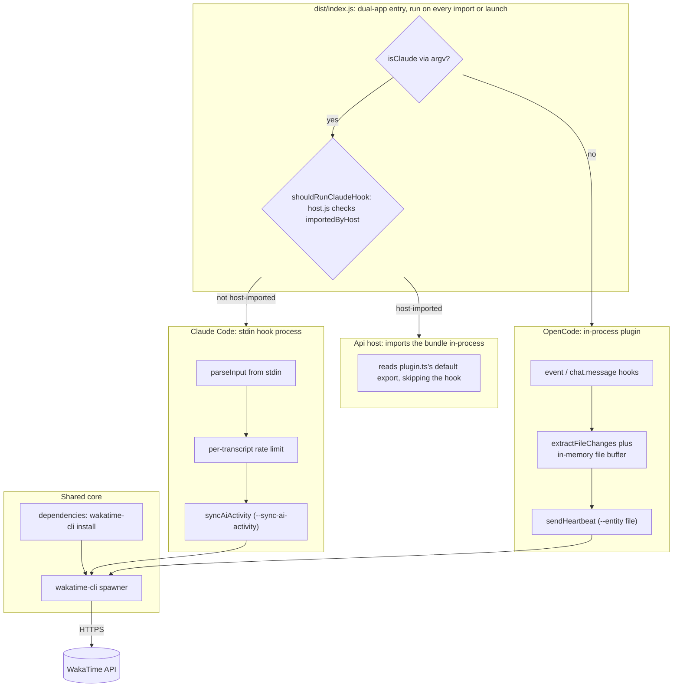

# wakatime-sync

[](https://www.npmjs.com/package/wakatime-sync)
[](https://www.npmjs.com/package/wakatime-sync)
[](https://github.com/intisy-ai/wakatime-sync/actions)

WakaTime integration for both OpenCode and Claude Code from a single codebase. It automatically records the time you spend coding with AI (tracking edited files, line changes, and project activity) and reports it to WakaTime via the official `wakatime-cli`.

## Under-the-Hood Architecture



## Structure

- `src/`
  - TypeScript source (OpenCode plugin, the `claude/` hook handler, `commands.ts`, `plugin.ts` for the api plugin, and `host.ts` for the host-import guard)
  - `plugin.json`: the manifest an in-process host reads before importing this bundle
- `dist/`
  - `dist/index.js` (single dual-app entry, generated by esbuild; not committed)

## Installation

### Via plugin-updater (recommended)

```bash
npx plugin-updater@latest init https://github.com/intisy-ai/wakatime-sync
```

### Via npm

```bash
npm install wakatime-sync
```

## API Key Setup

Add your WakaTime API key to `~/.wakatime.cfg`:

```ini
[settings]
api_key = your-api-key-here
```

Get your key at https://wakatime.com/settings/api-key.

## Configuration

Config file: `<configDir>/config/wakatime-sync.json` (edit it directly, or through whatever settings surface the app offers).

```json
{
  "logging": true,
  "heartbeat_interval_seconds": 60,
  "cli_update_interval_hours": 4,
  "api_key": "",
  "api_url": "https://api.wakatime.com/api/v1",
  "hide_filenames": false,
  "proxy": "",
  "hostname": "",
  "hide_project_names": false
}
```

| Key | Default |
| --- | --- |
| `logging` | `true` |
| `heartbeat_interval_seconds` | `60` |
| `cli_update_interval_hours` | `4` |
| `api_key` | `""` |
| `api_url` | `"https://api.wakatime.com/api/v1"` |
| `hide_filenames` | `false` |
| `proxy` | `""` |
| `hostname` | `""` |
| `hide_project_names` | `false` |

## Commands

| Command | Description | Arguments |
| --- | --- | --- |
| `/wakatime` | Show today's WakaTime coding activity |  |

## Dependencies

- `core`
- `wakatime-cli`
- `@opencode-ai/plugin`

## Logging

Logs are written to `<configDir>/logs/YYYY-MM-DD/wakatime-sync-HH-MM-SS.log` and are toggled by
this plugin's `logging` config (default on). Console mirroring is global, off by default,
and controlled by the shared `config/settings.json` `logConsole` flag.

## License

MIT.
